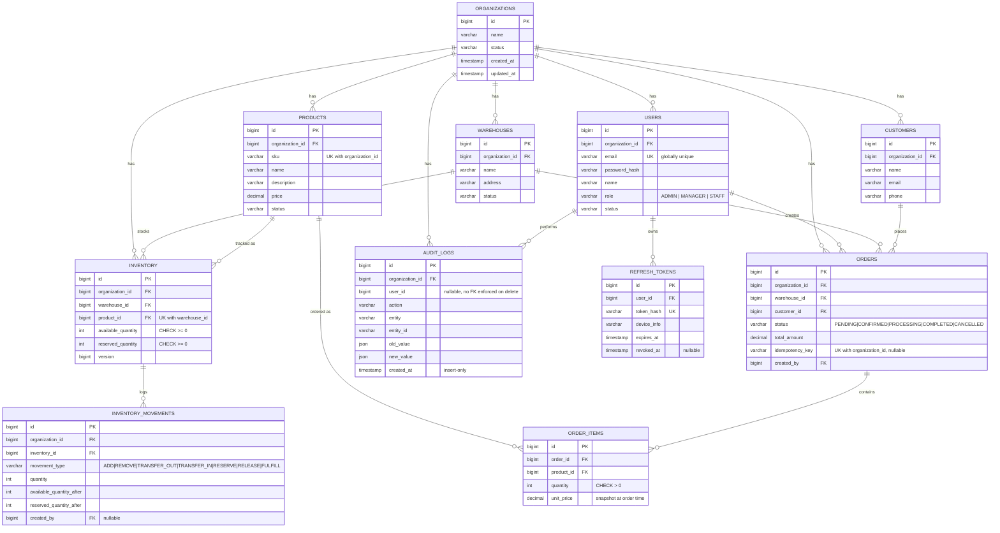

# Database Design

MySQL 8.4, InnoDB. Schema is versioned via Flyway (`backend/src/main/resources/db/migration/`) — four migrations, applied in order: auth/tenancy, products/warehouses/inventory, customers/orders, audit logs.

## ER Diagram

## Tables

### `organizations`
The tenant root. Every other tenant-scoped table carries `organization_id` and every query that touches one of those tables is filtered by it — see [SECURITY.md](SECURITY.md) for how that's enforced structurally rather than left to convention.

### `users`
- `email` is **globally unique**, not scoped per organization (`UNIQUE(email)`, not the originally-sketched `UNIQUE(organization_id, email)`). Login takes only email + password with no organization selector, so email has to be resolvable to exactly one user account across the whole system. Documented as a stated assumption — see [ADR-005](ADR-005-global-email-uniqueness.md).
- `role` is a plain string enum (`ADMIN`/`MANAGER`/`STAFF`) rather than a normalized roles table — three fixed roles, no per-organization custom roles, so normalizing would add a join for no benefit at this scope.

### `refresh_tokens`
Stores only a SHA-256 hash of the token, never the raw value — a database leak doesn't hand out usable sessions. `revoked_at IS NULL` means active; rotation marks the old row revoked and inserts a new one rather than updating quantities in place, giving a natural audit trail of every refresh a session went through.

### `warehouses`, `products`, `customers`
Straightforward tenant-scoped entities. `products.sku` is unique per organization (`UNIQUE(organization_id, sku)`) — two different tenants can use the same SKU, one tenant cannot reuse one.

### `inventory`
One row per `(warehouse_id, product_id)` pair (`UNIQUE(warehouse_id, product_id)`). `available_quantity` and `reserved_quantity` are never read-modify-written by application code — every change goes through a single atomic `UPDATE ... WHERE available_quantity >= ?` (or `reserved_quantity >= ?`) statement. See [ARCHITECTURE.md](ARCHITECTURE.md) and [ADR-003](ADR-003-concurrency-strategy.md) for why. The `CHECK (available_quantity >= 0)` and `CHECK (reserved_quantity >= 0)` constraints are the database-level backstop for "inventory must never go negative" — never relied upon by application logic, but they mean the invariant holds even against a hypothetical future bug. `version` is kept for optimistic-locking documentation per the assignment brief, though the actual concurrency guarantee comes from the conditional UPDATE, not from this column.

### `inventory_movements`
Append-only history of every inventory operation (add/remove/transfer/reserve/release/fulfill), satisfying the spec's "inventory history" requirement. One row per state change, with the resulting quantities captured at that point — reconstructs the full timeline for any inventory row without needing to replay events.

### `orders` / `order_items`
- `idempotency_key` is nullable with `UNIQUE(organization_id, idempotency_key)` — MySQL treats multiple `NULL`s as distinct in a unique index, so orders without a supplied key never collide with each other.
- `order_items.unit_price` is a **snapshot** of the product's price at order time, not a live reference — a later price change never rewrites a historical order's total.
- `total_amount` is denormalized onto `orders` (computed once at creation, stored) rather than always summed from `order_items` at read time — a standard, deliberate trade-off for a value that's read far more often than it changes.

### `audit_logs`
Insert-only — no code path anywhere issues an `UPDATE` or `DELETE` against this table. `old_value`/`new_value` are MySQL `JSON` columns holding pre-serialized snapshots, satisfying the spec's audit example format. `user_id` has no enforced foreign key against `users(id)` on delete (nullable, informational) since an audit trail should survive even if the acting user is later removed.

## Indexes

Every tenant-scoped table has an index on `organization_id` (the column every query filters by first). Composite indexes/uniques where the access pattern demands them: `(organization_id, sku)` on `products`, `(warehouse_id, product_id)` on `inventory`, `(organization_id, idempotency_key)` on `orders`, `(entity, entity_id)` on `audit_logs` for looking up an entity's full history.
